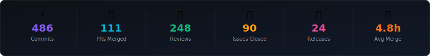
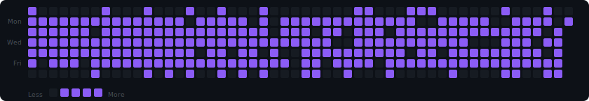
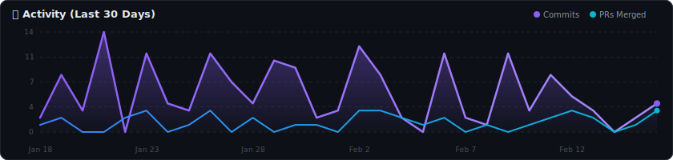
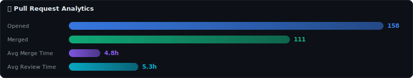
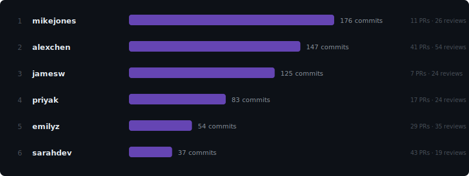
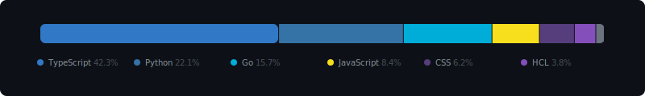
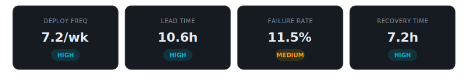

<div align="center">

# ⚡ DevMetricsDash

### Developer Metrics Dashboard — Auto-Updated Every Day

A beautiful, auto-updating developer metrics dashboard that lives **right inside your GitHub repo**.  
Open the repo → see your stats. Click through → explore the full interactive dashboard.

```
📊 Tracking 5 repositories · 6 contributors · 90 day window
```

[](https://github.com/ritz-devbox/DevMetricsDash/actions)

---

</div>

## 📈 Overview

<div align="center">



</div>

## 🔥 Contribution Activity

<div align="center">



</div>

## 📊 Activity Trends

<div align="center">



</div>

## 🔀 Pull Request Analytics

<div align="center">



</div>

## 👥 Top Contributors

<div align="center">



</div>

## 🗂️ Language Breakdown

<div align="center">



</div>

## 🎯 DORA Metrics

<div align="center">



</div>

---

<div align="center">

### 📊 [View Full Interactive Dashboard →](https://ritz-devbox.github.io/DevMetricsDash/)

</div>

---

## 🛠️ Tech Stack

| Layer | Technology | Purpose |
|---|---|---|
| **Dashboard** | React + TypeScript + Vite | Interactive GitHub Pages site |
| **UI** | Tailwind CSS + Framer Motion | Sleek dark theme with animations |
| **Charts** | Recharts + Custom SVGs | Area, bar, radar, heatmap, scatter, donut charts |
| **Data** | GitHub REST API (Octokit) | Fetches commits, PRs, issues, releases |
| **Automation** | GitHub Actions (cron) | Daily auto-fetch, generate, deploy |
| **Hosting** | GitHub Pages | Free, zero-config deployment |

## 📁 Project Structure

```
DevMetricsDash/
├── .github/workflows/          # GitHub Actions (daily auto-update)
│   └── update-metrics.yml
├── assets/                     # Auto-generated SVG charts (shown in README)
├── dashboard/                  # React interactive dashboard (deployed to Pages)
│   └── src/
│       ├── components/         # Charts, cards, layout
│       ├── pages/              # Overview, Repos, Team, PRs, Issues, Code Velocity, DORA
│       └── services/           # Data loading utilities
├── data/                       # Cached metrics JSON
├── scripts/                    # Data fetching & generation scripts
│   ├── fetch-metrics.ts        # GitHub API data fetcher
│   ├── generate-svg-charts.ts  # SVG chart generator for README
│   ├── generate-readme.ts      # Auto-builds this README
│   └── generate-sample-data.ts # Demo data generator
├── config.yml                  # Configuration (repos, users, settings)
└── README.md                   # You're reading it!
```

## 🚀 Quick Start

### 1. Clone & install

```bash
git clone https://github.com/ritz-devbox/DevMetricsDash.git
cd DevMetricsDash
npm install
cd dashboard && npm install && cd ..
```

### 2. Add your GitHub token

Go to your repo on GitHub → **Settings** → **Secrets and variables** → **Actions** → **New repository secret**

| Name | Value |
|---|---|
| `GH_PAT` | Your [Personal Access Token](https://github.com/settings/tokens) with `repo` scope |

### 3. Configure

Edit `config.yml` with your GitHub username and repos:

```yaml
owner: "your-github-username"

# Leave empty to track ALL your repos automatically
repositories: []

# Or list specific repos
# repositories:
#   - my-project
#   - another-repo
```

### 4. Run manually (optional)

```bash
# Generate sample data for preview
npx tsx scripts/generate-sample-data.ts

# Or fetch real data (needs GITHUB_TOKEN env var)
# export GITHUB_TOKEN=your_token_here
# npx tsx scripts/fetch-metrics.ts

# Generate SVG charts & README
npx tsx scripts/generate-svg-charts.ts
npx tsx scripts/generate-readme.ts

# Start the interactive dashboard locally
cd dashboard && npm run dev
```

### 5. Enable GitHub Pages

Go to your repo → **Settings** → **Pages** → Source: **GitHub Actions**

### 6. Trigger the workflow

Go to **Actions** tab → **📊 Update DevMetricsDash** → **Run workflow**

The Action runs automatically every day at 6 AM UTC after that.

## ✨ Features

- **📊 7 SVG Charts in README** — See your stats the moment you open the repo
- **🌐 Full Interactive Dashboard** — Deployed to GitHub Pages with filters & drill-downs
- **🔥 Contribution Heatmap** — GitHub-style but with custom colors & hover tooltips
- **🔀 PR Analytics** — Merge time distribution, size vs time scatter, filterable lists
- **👥 Team Insights** — Contributor cards, skill radar charts, comparison bars
- **🎯 DORA Metrics** — Industry-standard engineering performance with animated gauges
- **📈 Code Velocity** — Lines added/deleted trends, churn rate, commit size distribution
- **🐛 Issue Analytics** — Close time distribution, label breakdown, issues by repo
- **🤖 Fully Automated** — GitHub Actions fetches, generates, commits & deploys daily
- **🌙 Dark/Light Theme** — Glassmorphism design with gradient accents & smooth animations
- **📱 Mobile Responsive** — Collapsible sidebar for small screens
- **⌨️ Keyboard Navigation** — Alt+Arrow keys to switch between pages
- **📸 Export to PNG** — One-click screenshot of any dashboard page

---

<div align="center">

📊 Auto-generated by **DevMetricsDash** · Last updated 2026-03-02

<sub>⭐ Star this repo if you find it useful!</sub>

</div>
